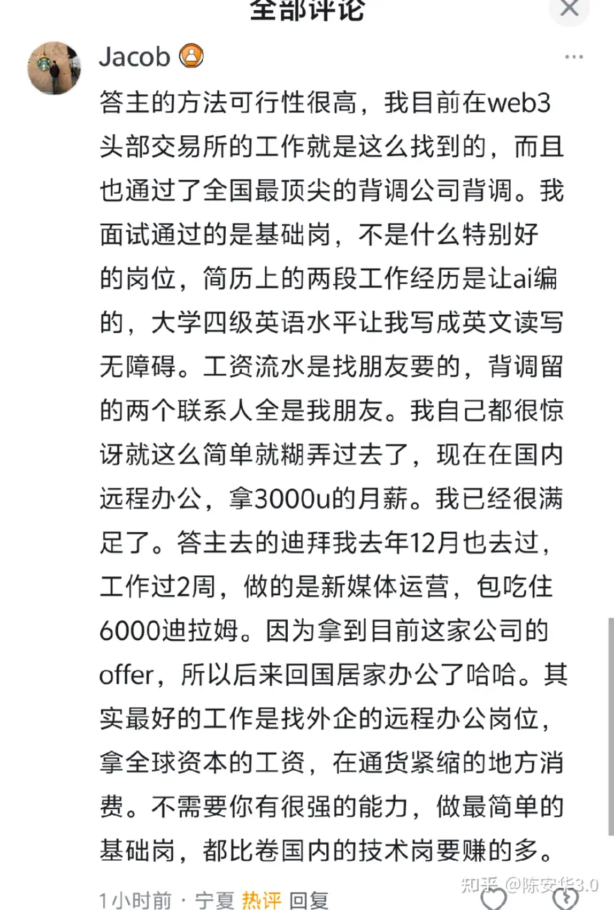

[原文链接](https://www.zhihu.com/question/1897959255778231029/answer/2026919953501038094)

# Q: 你的低成本爱好是什么？

编造身份和简历，拿去找工作。找到之后快速摸清行业，结识人脉。然后编出更夸张的身份和履历，去找下家，工资翻倍。

笔者在三月初谈到了人生第一个签劳动合同的正规工作。跳槽四次，昨天已经谈到了年包翻了3倍的海外销售offer。

---

观前提示：

1.本文不卖课，没有带货链接

2.一堆就会复读社保/背调就别来秀了，上市公司我都面一大把了你信吗？

这种都是很基础的问题了，要是这个都解决不了只能说明就是打工命了。。。。

---

最成功的案例 —-来自上海某985大学的群友 @Arthur.D ，他本来是按家里的要求准备考研的，也没有过实习经历。

我就和他一起编了一个案例，讲的是他如何做外贸，在实习生期间就签约了某国最大零售商。 （灵感源于我前上司的经历）

他把每一步都打磨的非常详细，几乎所有能问到的细节都可以圆回来。

写进简历之后，新能源公司的销售总监，CEO都来问过，但是从来没有被问倒。

所以今年校招，他拿了两万五的起薪，是所在学院的最高薪资，没有之一。 (截止发稿当天)

这个薪资在今年的校招市场里过于逆天，所以连学院的书记都亲自来过问过两回。

---

其实在《猫鼠游戏》主角-阿巴内尔的人生经历里，已经证实过了：

面试八分靠自信，二分靠套话，结果让初中学历的他当上了飞行员，大学教授，儿科医生。

如果用现代的话来讲，就是世界上几乎所有的工作，都只要“简易上下文学习”就能上岗了。

在中国找工作，其实几乎不存在背调问题。99.9%的中小公司都没有专业背调，剩下的大厂，校招时也不背调实习。

而且就算你真被查出来了又如何？难道就一定会有影响吗？猎头有面试kpi，领导懒得花时间选新人。有的时候睁一只眼闭一只眼就过了。 之前华为还有一堆作弊考进去当外包的，事发之后谁也没受处分。

所以说，面试真正考察的就是：

你能不能用行业的话把简历写满。然后在面试时，用300%的自信的证明你made it .

---

PS:也有人问我怎么编简历，没时间细说，先写了几个要点在文末。也有一些质疑，我在评论区回复了。这张图写的非常好，我觉得能解释很多问题。

目前笔者在迪拜，还在摸索新的机会。这里的求职市场和中国差异极大。

不过，我也肯定编简历的机会更多了，因为跨国之后也没啥办法背调了。主要就看你领英主页的包装。

所以在机会多的新兴市场，直接编人设，打造身份，才是最有用的。因为职场就没卷到需要你真有能力。

与其在一个回报底下的服务器死磕，不如一开始就换游戏玩。

---

求职上，只有几条小建议：

1.claude在简历上的能力断档领先，有条件要开会员。gemini可以一起辅助使用。让他们两个给你打分看看。

2.查看一下boss直聘的ai简历评分功能，通常来说大多数人抱怨boss直聘是因为简历写不出来，ai看完以后不知道你做过什么，只能给你50分。也只会给你推不及格的劣质企业。

改进方案是seo优化，把简历改成100分。最简单的方法是多加几个项目，每个项目都编个具体数字，比如营业税被你节省了10%。更简单的方法是请教gemini和claude老师。

到了这一步，一般推送就是月薪2w起的大厂了。

3.你在同行那里做过，而且做的非常好。这句话足够你通过所有面试

一般来说，中型往上企业的同行就那么多，面试你那个人肯定都是知道大致项目组的。让他知道你在同行的工作组做过，而且做的非常好。你只是因为非个人原因离职的(管理层内斗，或者是公司太小，上线低)

4.行业和城市一起选。

你在齐齐哈尔市找不到工作，因为齐齐哈尔没有任何高收入行业。

你是年薪百万的外贸销冠，不妨碍你在一个没有外贸公司的城市找不到对口工作。

可以先去boss猎聘小红书，各种投资报道看一遍，目前正在这个城市崛起的行业是什么，招募的一般是什么岗位。

比如深圳新兴制造业的外贸岗，杭州的自媒体编导，缅甸的园区组长(划掉)。

我觉得只看一线城市加杭州/大湾区就够了，这些城市优质行业产生的水岗位太多了，已经比其他城市加起来还多了。从效率角度看，只考虑一线那几个➕杭州就可以了。

再反过来倒退自己需要的经验，你可以在网上找到一个同行，花钱让他给你讲一遍工作经验。记住细节，来反向证明是你做的。

5.为什么重视细节？

我已经说了，中国大多数企业没有严格背调，面试主要看直属领导/HR对你的第一印象。

那他们怎么判断你的能力？就是问办公碰到的难题，看看你实际回答的细节，和他们是不是一样的。

这里有个小技巧，一般年龄比较大，经历过大起大落的直属领导，会非常看中抗压能力。或者是早年间有创业经历的也一样。

在他们面前，你可以不用多讲自己的业绩。反而是多讲一讲自己过去遇到的困难，把困难突出，讲明白自己怎么艰难克服掉的。依靠他们共情心理。

我之前看过Reddit上美国职场的求职讨论，美国人面对这种情况给出来的最优解也是这个方案。

6.面试问一大堆都是套方案的，真想找你的基本上10分钟就问好了，超过10分钟就去聊家常这样才对。

---

话说了这么多，你不做也没用。

想成为什么就直接成为，把心态拿出来！从现在开始相信你能做到，然后现在立刻马上去做！