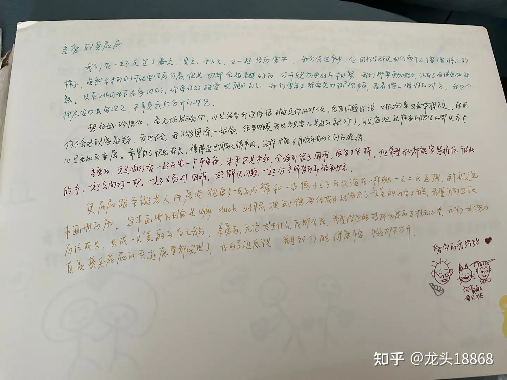
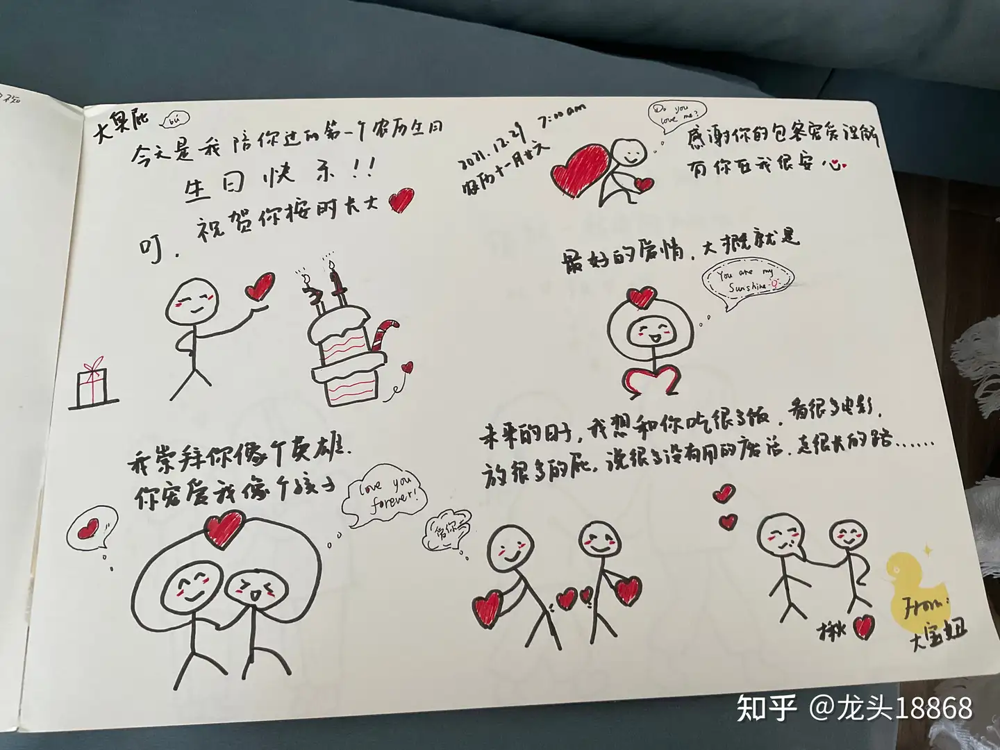
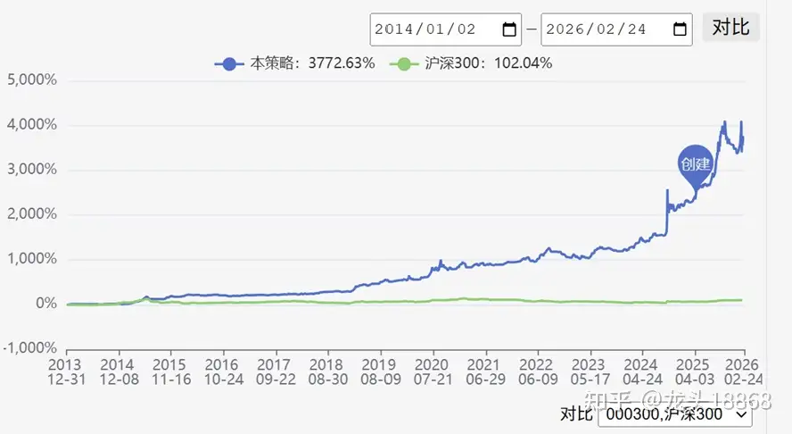
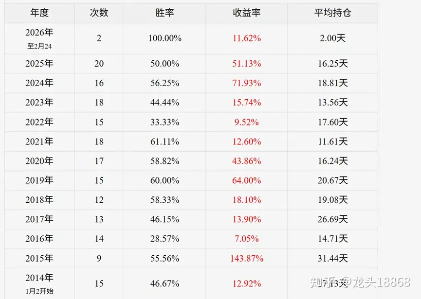
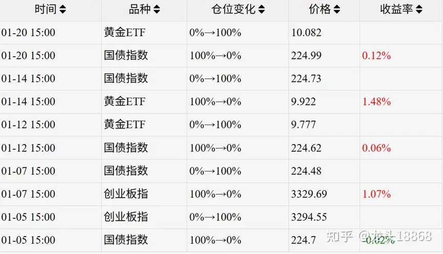
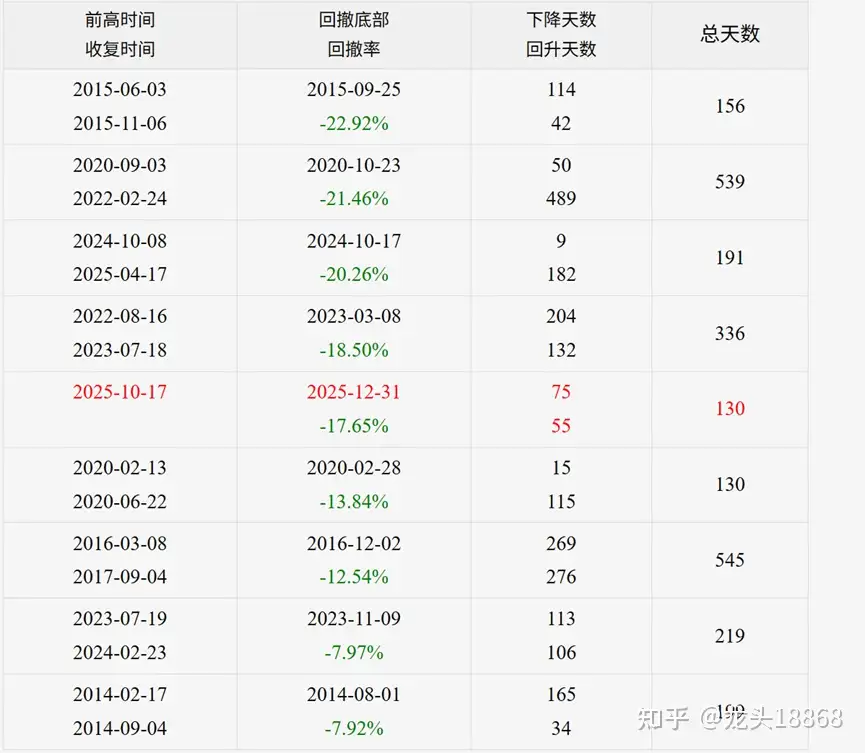

[原文链接](https://www.zhihu.com/question/603826642/answer/2009027716129785386)

----

# Q: 我们这代人存不下钱的原因是什么？

我老婆让我关注的啤酒股又全部大涨了，我买的市值比较小股，就不公开说了，出口海外占业务的40%哈哈哈哈哈哈哈

我老婆：23年看李佳琪直播，有个stanley杯子爆火，跟我分享，然后买了一个

我：看看制造商是不是中国的，果然发现是嘉益股份制造的，然后我买入仓位，赚了几百个杯子钱

我老婆：逛街看到泡泡玛特的molly好喜欢，labubu也不错。磨着我买杯子

我：找股票，港股上市，买入，赚钱

我老婆：各种衣服折扣就走不动道，手机一年就想换一个，眼镜5个起步，还想让儿子把眼镜掰断，在买一个。

我：凡是买第二件半价这种广告，我只看中一件的话绝对不会为了折扣多买

我老婆：买东西要的就是情绪价值，美甲，美发，每月要买小饰品，衣服，包包，帽子。会掉入各种消费陷阱

我：存钱存钱存钱，除了健身和吃东西基本不花钱

最后我老婆存款月光

我存款450w。

评论有人问我老婆现在关注啥，最近过节我们家买了挺多啤酒和精酿，老婆说你说世界杯快到了，是不是啤酒股能涨，我搜了下豆包貌似还真有机会

[微信推文](https://mp.weixin.qq.com/s/MYcFDNNfm49nqu2GJxG55A)

我老婆是很好的人，花的钱也很有限，会记住我所有的需求。

无条件信任我。情绪价值拉满。然后本身还是个博士，逻辑思维能力强，除了理财弱一些外，都很强。家里很多东西都是老婆安排，也很辛苦的，买东西也会淘宝凑单。总之量入为出我觉得挺好

收到大家好多祝福，简单分享个目前自己在做的量化策略供大家参考。

一个简单的量化轮动策略11年，37倍收益。远超单纯持有纳指或者黄金或者我们能配置的任何单一资产

轮动包括纳指etf，黄金etf，创业板etf，和国债etf

都是大家耳熟的优质资产，其中创业板etf受益于国内产业趋势发展。13-15年移动互联网

19-21新能源和医药牛市，23-25ai发展也勉强算优质资产

以下是年度收益

按年度算每年都是盈利

方向做多

- 每日调仓 T日交易即当日判断当日交易 最少持有1个自然日
- 空仓时持有国债指数
- 持有第1名 排名不符合要求后平仓，
- 持仓时仅判断平仓条件 空仓时仅判断开仓条件

【轮动排序】

现价相对于20日前收盘价的涨幅，比较轮动资产的涨幅大小

【交易条件】

开仓: 现价大于 20日高点的0%，并且要求该资产是排名第一的。

平仓: 现价小于 20日低点的0% 或者排名不符合第一名时候平仓

这是26年的量化调仓，目前持有黄金etf，

纳指七巨头里面除了英伟达都因为资本开支问题进入了技术熊市，该系统很好的规避了这个问题。

回撤率是多少呢。最多20%，也还算能接受。因为都是赚了钱后回撤，

比较考验人的是如果你运气不好一进去就回撤20%就会比较难受。总体坚持下来收益应该不错。

最后讲一下为什么会有这种情况，因为资本永不眠。

22年是资本绞杀大年，但是量化系统靠黄金撑住了

比如纳指22年因为加息大跌，但是黄金当年涨幅9%，

创业板几次产业发展涨幅巨大，移动互联网，新能源和医药。

资本永远追求盈利。动量就代表了短期资金的方向。然后设好止盈止损就是一个好策略。

本系统如果所有资产都表现不好，还可以持有无风险的国债etf来规避风险。

如果需要回测的全部数据研究可以看看

[微信公众号链接](https://mp.weixin.qq.com/s/ZazfrtnRoXrUJADqogVtUA)

欢迎关注工号，龙头18868